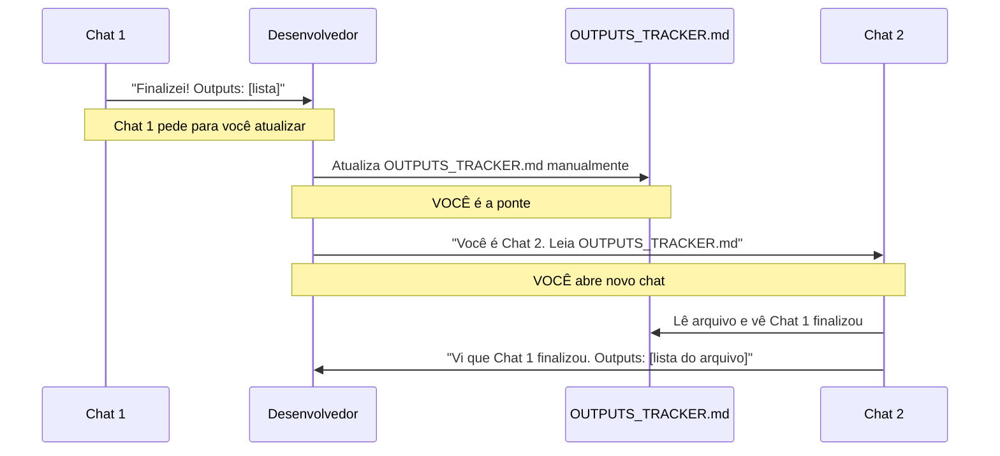
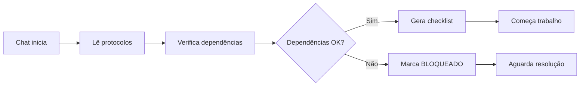
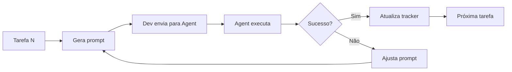
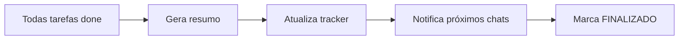

# 🤝 PROTOCOLO DE COLABORAÇÃO INTER-CHATS

## 🎯 Propósito
Este documento define as regras de trabalho entre os 4 chats que implementarão o sistema de catálogo de cosméticos. Cada chat é autônomo, mas deve seguir este protocolo para garantir integração harmoniosa.

---

## 👥 Identificação dos Chats

### Chat 1: Backend Foundation
**Responsável:** Infraestrutura backend (APIs, Database, Auth)
**Dependências:** Nenhuma (começa primeiro)
**Entrega para:** Chat 2, Chat 3, Chat 4

### Chat 2: Frontend Foundation  
**Responsável:** Estrutura frontend (Layout, UI, Roteamento)
**Dependências:** Chat 1 (APIs e tipos)
**Entrega para:** Chat 3, Chat 4

### Chat 3: Features Core
**Responsável:** Funcionalidades de negócio (Catálogo, Upload, Busca)
**Dependências:** Chat 1 + Chat 2
**Entrega para:** Chat 4

### Chat 4: Integration & PWA
**Responsável:** PWA offline, Service Workers, Sync
**Dependências:** Chat 1 + Chat 2 + Chat 3
**Entrega para:** MVP finalizado

---

## 🔑 COMO A "COMUNICAÇÃO" REALMENTE FUNCIONA

### ❌ O que NÃO existe:
- Chats não conversam diretamente entre si
- Chats não detectam automaticamente status de outros
- Não há notificações automáticas entre chats
- Não há variáveis compartilhadas em tempo real

### ✅ O que REALMENTE acontece:



### Fluxo passo a passo:

1. **Chat 1 trabalha** e completa tarefas
2. **Chat 1 avisa VOCÊ:** "Atualize OUTPUTS_TRACKER.md com: [texto]"
3. **VOCÊ abre** OUTPUTS_TRACKER.md
4. **VOCÊ copia** o texto que Chat 1 forneceu
5. **VOCÊ cola** na seção do Chat 1
6. **VOCÊ salva** o arquivo
7. **VOCÊ abre** novo Chat 2
8. **VOCÊ diz:** "Leia OUTPUTS_TRACKER.md, Chat 1 finalizou"
9. **Chat 2 lê** o arquivo e vê que Chat 1 finalizou
10. **Chat 2 usa** as informações do arquivo para trabalhar

### OUTPUTS_TRACKER.md = Quadro branco compartilhado

```
É como um documento Google Docs onde:
- Chat 1 deixa recados (via você)
- Chat 2 lê recados (quando você pede)
- Todos consultam status (quando você pede)

MAS... quem escreve? VOCÊ!
MAS... quem manda ler? VOCÊ!
```

---

## 📋 Regras Obrigatórias

### Regra 1: Leitura Obrigatória ao Iniciar

**IMPORTANTE:** Chats NÃO se comunicam automaticamente. O **DESENVOLVEDOR é a ponte** entre eles.

**DESENVOLVEDOR inicia cada chat com:**

```
"Você é Chat [X] - [Nome].

Leia na ordem:
1. PROJECT_PROTOCOL.md
2. MASTER_CONTEXT.md
3. OUTPUTS_TRACKER.md ← Status de outros chats está aqui
4. [SEU_SPEC].md

[Se chat anterior finalizou]
Chat [Y] finalizou. Veja outputs no OUTPUTS_TRACKER.md.

[Se ainda aguardando]
Chat [Y] ainda não finalizou. Você está bloqueado."
```

**Chat responde confirmando leitura:**

```
✅ Chat [X] - [Nome] iniciando

Li os documentos:
- PROJECT_PROTOCOL.md
- MASTER_CONTEXT.md  
- OUTPUTS_TRACKER.md
- [MEU_SPEC].md

Status das dependências (vi no OUTPUTS_TRACKER.md):
- Chat 1: [STATUS que você leu no arquivo]
- Chat 2: [STATUS que você leu no arquivo]

[Se todas dependências OK]
→ ✅ Dependências atendidas! Posso começar.

[Se alguma dependência faltando]
→ ⚠️ BLOQUEADO: OUTPUTS_TRACKER.md mostra que Chat [Y] 
ainda não finalizou. Aguardando desenvolvedor atualizar.
```

**CRÍTICO:** O chat **NÃO detecta automaticamente** quando outro chat finaliza. Ele **LÊ o arquivo OUTPUTS_TRACKER.md** que o desenvolvedor atualiza manualmente.

---

### Regra 2: Verificação de Dependências

**Antes de gerar qualquer prompt para o Agent:**

```yaml
Chat 1 (Backend):
  Pode começar: SEMPRE (sem dependências)
  
Chat 2 (Frontend):
  Pode começar SE:
    - Chat 1 status = ✅ FINALIZADO
    - APIs essenciais criadas
    - Tipos TypeScript disponíveis
    
Chat 3 (Features):
  Pode começar SE:
    - Chat 1 status = ✅ FINALIZADO
    - Chat 2 status = ✅ FINALIZADO
    - APIs + componentes UI prontos
    
Chat 4 (Integration):
  Pode começar SE:
    - Chat 1 status = ✅ FINALIZADO
    - Chat 2 status = ✅ FINALIZADO
    - Chat 3 status = ✅ FINALIZADO
    - Sistema base funcional
```

**Se dependência não atendida:**

```markdown
⚠️ BLOQUEIO DETECTADO

Chat: [SEU NOME]
Data: [TIMESTAMP]
Problema: Chat [X] ainda não finalizou

Dependências faltantes:
- [Lista do que está faltando]

Ações:
1. Atualizar OUTPUTS_TRACKER.md com status BLOQUEADO
2. Aguardar desenvolvedor resolver
3. NÃO gerar prompts até desbloqueio
```

---

### Regra 3: Atualização de Outputs (VIA DESENVOLVEDOR)

**Processo:**

1. **Chat finaliza tarefa** e gera texto de atualização
2. **Chat pede ao desenvolvedor:** "Atualize OUTPUTS_TRACKER.md com:"
3. **Chat fornece texto completo** para copiar
4. **DESENVOLVEDOR copia** o texto
5. **DESENVOLVEDOR atualiza** OUTPUTS_TRACKER.md manualmente
6. **DESENVOLVEDOR salva** o arquivo no projeto

**Formato do texto que chat fornece:**

```markdown
## [TIMESTAMP] - Chat [X]: [Tarefa]

✅ **Concluído:** [Nome da tarefa]

**Arquivos criados/modificados:**
- /caminho/para/arquivo1.ts
- /caminho/para/arquivo2.tsx

**Exports disponíveis:**
- `export type Brand = {...}`
- `export function createProduct(...)`

**APIs criadas:**
- POST /api/brands
- GET /api/products

**Avisos para próximos chats:**
⚠️ [Algo importante que eles precisam saber]

**Próxima tarefa:** [Nome da próxima]
```

**IMPORTANTE:** Chat NÃO consegue atualizar o arquivo sozinho. Ele depende do desenvolvedor fazer isso manualmente.

---

### Regra 4: Formato Padrão de Prompt para Agent

**TODO prompt gerado DEVE seguir este template:**

```markdown
# PROMPT PARA AGENT (VS CODE)

## 🎯 Contexto Geral
[1-2 parágrafos sobre o sistema completo]

## 📍 Contexto Específico
[O que essa tarefa resolve]
[Por que é necessária]

## 🔗 Dependências
**Arquivos que já devem existir:**
- /caminho/arquivo1.ts
- /caminho/arquivo2.tsx

**APIs que devem estar funcionando:**
- POST /api/endpoint1
- GET /api/endpoint2

**Bibliotecas necessárias:**
- next@15.x
- prisma@5.x

## 📝 Tarefa
[Descrição clara e objetiva do que fazer]

## 📂 Arquivos Afetados

**Criar:**
- /app/api/novo-endpoint/route.ts
- /components/NovoComponente.tsx

**Modificar:**
- /lib/algum-arquivo.ts (adicionar função X)

**Deletar:**
- /temp/arquivo-obsoleto.ts

## 💻 Código/Configuração Esperado

```typescript
// Exemplo do código que deve ser gerado
export async function handler(req: Request) {
  // implementação
}
```

## ✅ Testes de Validação

**Comando 1:**
```bash
npm run test
```
**Output esperado:** All tests passed (15/15)

**Comando 2:**
```bash
npm run lint
```
**Output esperado:** No linting errors

**Comando 3:**
```bash
curl -X POST http://localhost:3000/api/test
```
**Output esperado:** {"status": "ok"}

## 🎯 Critérios de Sucesso

- [ ] Build passa sem erros (`npm run build`)
- [ ] Testes passam (`npm test`)
- [ ] ESLint sem warnings
- [ ] TypeScript sem erros de tipo
- [ ] Código commitado com mensagem: `feat(escopo): descrição`

## 🔜 Próxima Tarefa
[Qual tarefa vem depois desta]

## 📌 Notas Adicionais
[Qualquer observação importante]
```

---

### Regra 5: Controle de Qualidade Mútuo

**Qualquer chat pode revisar outputs de outros chats.**

**Cenário 1: Chat detecta problema**

```markdown
🚨 ALERTA DE INCONSISTÊNCIA

De: Chat 3 (Features)
Para: Chat 1 (Backend)
Data: [TIMESTAMP]

Problema detectado:
- API POST /api/products retorna { id, name, sku }
- Chat 3 precisa de { id, name, sku, categoryId }

Impacto:
- Features de categorização não podem ser implementadas

Solução sugerida:
- Adicionar campo categoryId na resposta da API
- Atualizar tipo em /types/api.ts

Urgência: 🔴 ALTA (bloqueia Chat 3)
```

**Cenário 2: Chat sugere melhoria**

```markdown
💡 SUGESTÃO DE MELHORIA

De: Chat 4 (Integration)
Para: Chat 2 (Frontend)
Data: [TIMESTAMP]

Oportunidade:
- Componente ProductCard não está otimizado para offline
- Poderia usar React.memo() para melhor performance

Benefício:
- Renderização 40% mais rápida no modo offline

Urgência: 🟡 MÉDIA (não bloqueia, mas melhora UX)
```

---

### Regra 6: Resolução de Conflitos

**Se houver conflito técnico irreconciliável:**

1. **Chat identifica conflito**
2. **Documenta em OUTPUTS_TRACKER.md seção "🚨 CONFLITOS"**
3. **Alerta desenvolvedor (você)**
4. **PARA trabalho até decisão**

**Template de conflito:**

```markdown
## 🚨 CONFLITO TÉCNICO

**ID:** CONFLICT-001
**Data:** 2025-01-15
**Chats envolvidos:** Chat 1 vs Chat 3

**Descrição:**
Chat 1 implementou auth com JWT expirando em 15min.
Chat 3 precisa de sessões longas para uploads grandes (30min+).

**Opções:**

**Opção A (Chat 1):**
- Manter 15min por segurança
- Implementar refresh token automático
- Pros: Mais seguro
- Cons: Complexidade adicional

**Opção B (Chat 3):**
- Aumentar para 60min
- Simplifica uploads
- Pros: Simples
- Cons: Menos seguro

**Recomendação:** [Chat X sugere]

**Decisão final:** [AGUARDANDO DESENVOLVEDOR]
```

---

### Regra 7: Finalização de Chat

**Ao concluir TODAS tarefas do seu escopo:**

```markdown
## ✅ FINALIZAÇÃO - Chat [X]

**Data:** [TIMESTAMP]
**Status:** FINALIZADO

### 📊 Resumo de Entregas

**Tarefas concluídas:** [Número]
**Arquivos criados:** [Número]
**Testes implementados:** [Número]
**Cobertura de testes:** [Percentual]

### 🎁 Outputs Críticos

**Para Chat [Y]:**
1. [Output importante 1]
2. [Output importante 2]
3. [Output importante 3]

**Para Chat [Z]:**
1. [Output importante 1]
2. [Output importante 2]

### ⚠️ Avisos Importantes

1. [Algo que próximos chats precisam saber]
2. [Limitação conhecida]
3. [Decisão técnica importante]

### 🔜 Próximos Passos

✅ Chat [X+1] pode começar!

Dependências resolvidas:
- [Lista de dependências atendidas]

Arquivos prontos para uso:
- [Lista de arquivos]

### 🐛 Issues Conhecidos

- [Issue 1 - Impacto baixo]
- [Issue 2 - A ser resolvido por Chat X]

### 📚 Documentação Gerada

- [Link para docs]
- [OpenAPI spec]
- [ADRs criados]
```

---

## 🔄 Fluxo de Trabalho Típico

### Fase 1: Inicialização



### Fase 2: Execução



### Fase 3: Finalização



---

## 📊 Exemplo Completo de Interação

### 🎬 Cena: Chat 1 finalizando, Chat 2 começando

**OUTPUTS_TRACKER.md atualizado por Chat 1:**

```markdown
## ✅ Chat 1: Backend Foundation - FINALIZADO
**Data:** 2025-01-15 18:30

### Entregas:
- 18 APIs REST implementadas
- Schema Prisma com 8 tabelas
- Auth NextAuth.js configurado
- Testes: 87% coverage
- OpenAPI spec completo

### Arquivos críticos:
- /types/api.ts (tipos TypeScript)
- /lib/prisma.ts (client singleton)
- /app/api/* (endpoints)

### APIs disponíveis:
- POST /api/brands (criar marca)
- GET /api/brands/:id (buscar marca)
- POST /api/products (criar produto)
- GET /api/products (listar produtos)
- POST /api/images/upload (upload imagem)

### Auth configurado:
- NextAuth.js v5
- Provider: email/password
- JWT expiry: 15min
- Refresh token: 7 dias
- Middleware protege /api/*

### Avisos para Chat 2:
⚠️ Todos requests precisam header: Authorization: Bearer {token}
⚠️ Middleware redireciona 401 para /api/auth/signin
⚠️ Tipos em /types/api.ts DEVEM ser usados (não criar duplicados)

### Avisos para Chat 3:
⚠️ Upload de imagem limitado a 5MB
⚠️ Categorias aceitam max 50 chars no nome

✅ **Chat 2 (Frontend) pode começar!**
```

**Chat 2 inicia e lê tracker:**

```markdown
🚀 Chat 2: Frontend Foundation - INICIANDO
**Data:** 2025-01-16 09:00

✅ Li PROJECT_PROTOCOL.md
✅ Li MASTER_CONTEXT.md
✅ Li OUTPUTS_TRACKER.md
✅ Li FRONTEND_SPEC.md

### Verificação de dependências:

✅ Chat 1: FINALIZADO
  - APIs disponíveis: 18
  - Auth configurado: NextAuth.js
  - Tipos prontos: /types/api.ts

✅ Todas dependências atendidas!

### Notas do Chat 1 incorporadas:
- Usarei tipos de /types/api.ts (não vou duplicar)
- Headers de auth configurados no API client
- Redirecionamento 401 tratado no middleware

### Plano de trabalho:
1. Setup Next.js + Tailwind (Dia 1)
2. Layouts base (Dia 1-2)
3. Auth UI integrado com NextAuth (Dia 2)
4. Componentes reutilizáveis (Dia 2-3)
5. Dashboard básico (Dia 3)

### Primeira tarefa:
Gerar prompt para Agent: Setup inicial do projeto

🔜 Gerando checklist completo...
```

---

## 🎯 Métricas de Sucesso do Protocolo

### Para o Chat
- ✅ Leu todos documentos obrigatórios antes de começar
- ✅ Verificou dependências antes de cada prompt
- ✅ Atualizou OUTPUTS_TRACKER.md regularmente
- ✅ Seguiu formato padrão de prompts
- ✅ Finalizou com resumo completo

### Para o Desenvolvedor (você)
- ✅ Zero conflitos entre chats
- ✅ Fácil rastreamento de progresso
- ✅ Código coerente entre fases
- ✅ Documentação viva e atualizada
- ✅ MVP integrado sem retrabalho

---

## 🆘 Troubleshooting

### Problema: "Chat não está seguindo protocolo"

**Solução:**
```
Você (desenvolvedor):
"Leia PROJECT_PROTOCOL.md novamente e siga as regras.
Especificamente a Regra [X] não foi seguida."
```

### Problema: "Conflito entre chats"

**Solução:**
```
1. Identifique qual regra foi violada
2. Consulte OUTPUTS_TRACKER.md para ver histórico
3. Decida qual abordagem seguir
4. Atualize protocolo se necessário
```

### Problema: "Chat bloqueado por dependência"

**Solução:**
```
1. Verificar status do chat bloqueador no OUTPUTS_TRACKER.md
2. Se chat anterior está FINALIZADO, atualizar tracker
3. Se não, aguardar ou paralelizar (se possível)
```

---

## 📚 Documentos Relacionados

- **MASTER_CONTEXT.md** - Visão geral do sistema
- **OUTPUTS_TRACKER.md** - Status em tempo real
- **BACKEND_SPEC.md** - Especificação do Chat 1
- **FRONTEND_SPEC.md** - Especificação do Chat 2
- **FEATURES_SPEC.md** - Especificação do Chat 3
- **INTEGRATION_SPEC.md** - Especificação do Chat 4

---

## ✅ Confirmação de Leitura

**Ao ler este documento, cada chat deve confirmar:**

```markdown
✅ Chat [X] confirma leitura do PROJECT_PROTOCOL.md

Data: [TIMESTAMP]
Versão lida: 1.0

Compromissos:
- Seguirei todas as 7 regras obrigatórias
- Atualizarei OUTPUTS_TRACKER.md regularmente
- Verificarei dependências antes de cada prompt
- Usarei formato padrão de prompts
- Comunicarei problemas imediatamente

Assinatura: Chat [X] - [Nome]
```

---

**FIM DO PROTOCOLO**

**Versão:** 1.0  
**Criado:** 2025-01-11  
**Autor:** Claude (Arquiteto do Sistema)
